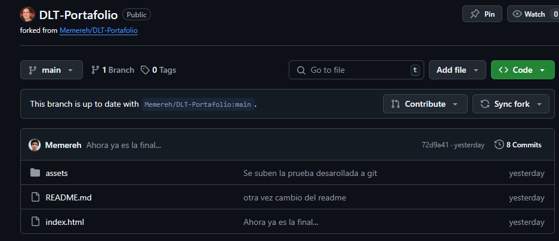
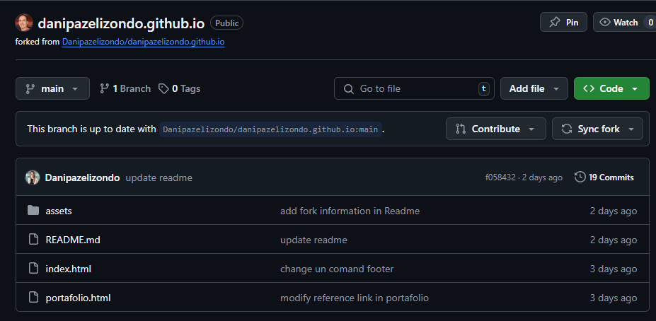
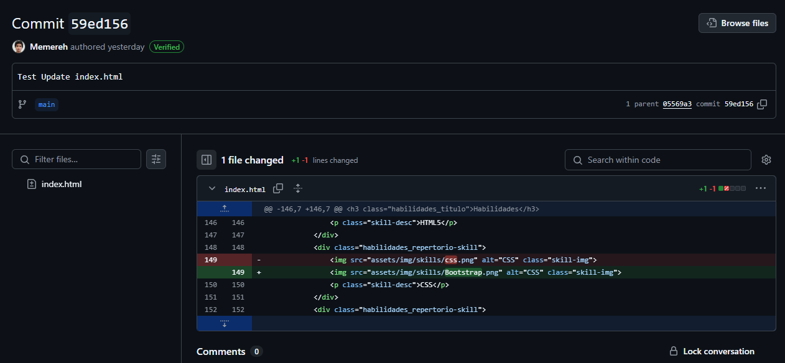
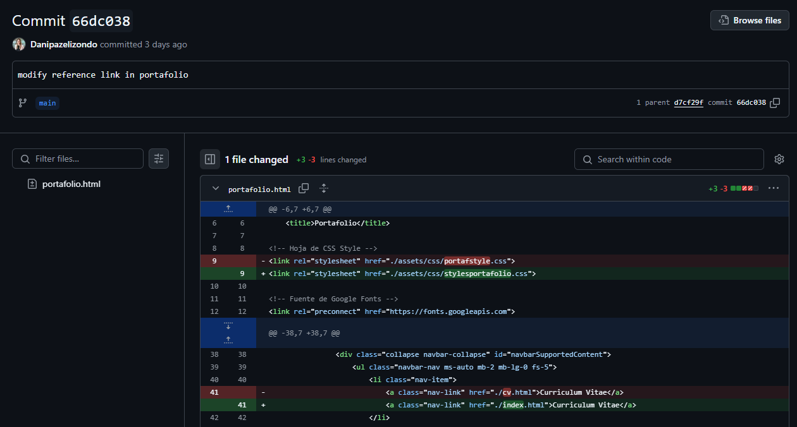
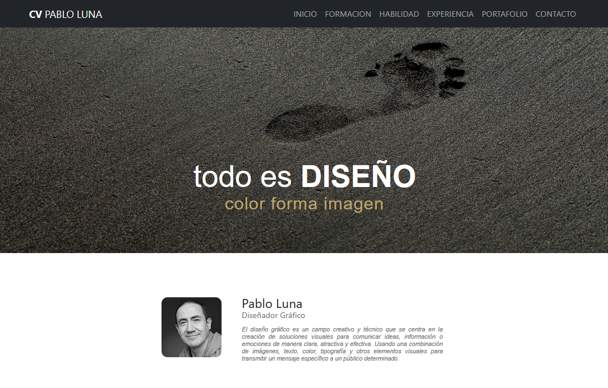

Prueba GITHUB Pablo Luna

Repositorio Clonado:

Foks:
1. Link (Fork a Repositorio de fdsw) https://github.com/plunap/fdsw-github.git

2. Link (Fork a Repositorio de DLT) https://github.com/plunap/DLT-Portafolio.git

3. Link (Fork a Repositorio de dani) https://github.com/plunap/danipazelizondo.github.io.git

Commits:
1. Link (Actualiza links) https://github.com/plunap/fdsw-github/commit/5c93b188502b3c3542b0a88357827636aed91922
 

2. Link (Actualiza Index) https://github.com/plunap/DLT-Portafolio/commit/59ed156b68a3e2c10b549379f5784f99c2237c7d

3. Link (Modifica link a Portafolio) https://github.com/plunap/danipazelizondo.github.io/commit/66dc0387691ab4d5c46b1243cc2120c164e88482

Despliegue de Página WEB:
https://plunap.github.io/PRUEBA-MODULO-1/
